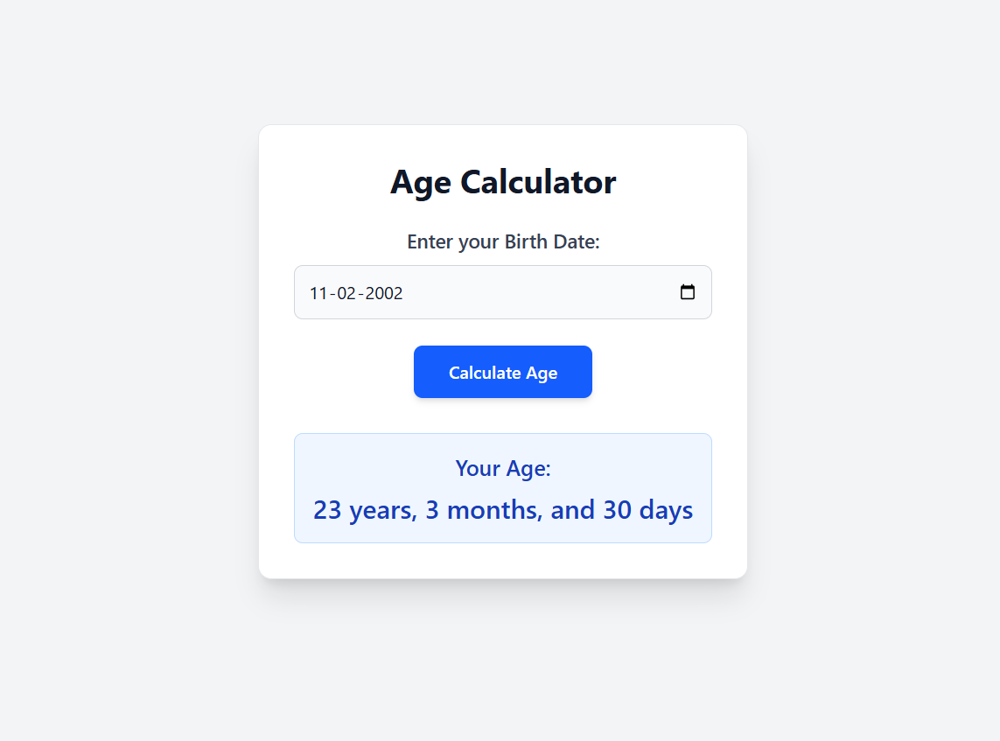

🎂 Age Calculator App
A simple and intuitive age calculator application built with React and styled using Tailwind CSS. This app allows users to input their birth date and instantly see their age in years, months, and days.

✨ Features
Date Input: Easy-to-use date picker for selecting the birth date.

Accurate Calculation: Calculates age precisely in years, months, and days.

Responsive Design: Works well on various screen sizes (mobile, tablet, desktop) thanks to Tailwind CSS.

Clean UI: Modern and minimalist interface for a smooth user experience.

🚀 Technologies Used
React: A JavaScript library for building user interfaces.

Tailwind CSS: A utility-first CSS framework for rapidly building custom designs.

JavaScript: The core programming language.

📦 Setup and Installation
To get this project up and running on your local machine, follow these steps:

Clone the repository:
Install project dependencies:

npm install
npm run dev